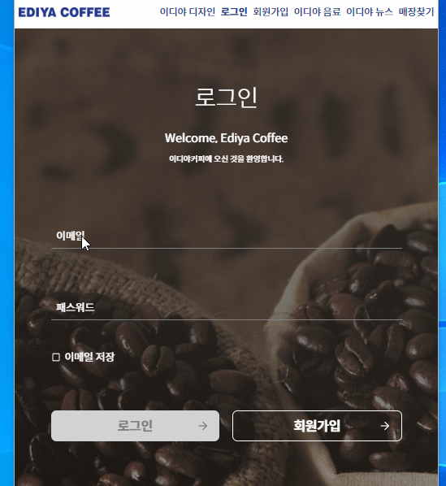

# 🦁 HTML/CSS 과제

## 바로가기

### 1. [mission - 01 (2023. 11. 04.)](https://github.com/jykim29/home-work/tree/main/mission-01)

### 2. [mission - 02 (2023. 11. 11.)](https://github.com/jykim29/home-work/tree/main/mission-02)

## 과제 요약

### 1. mission - 01 : 쿠팡 - 오늘의 발견 페이지

### 2. mission - 02 : 이디야커피 - 로그인 페이지

