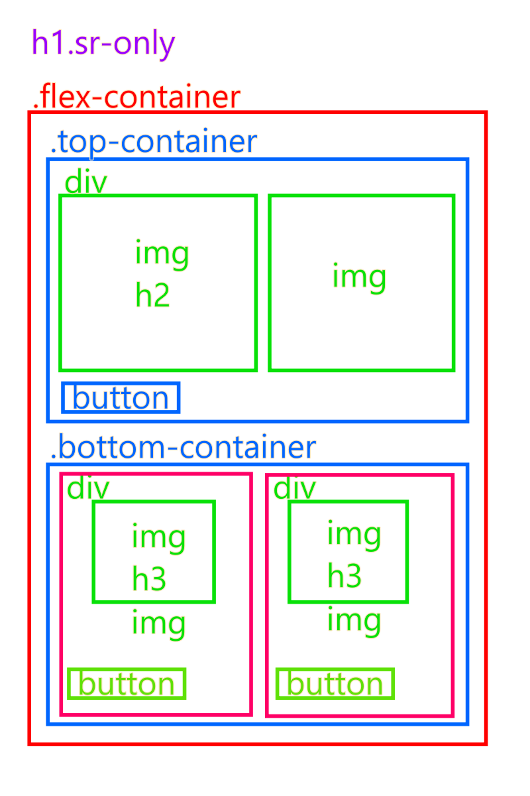
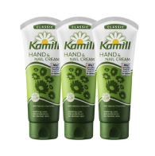
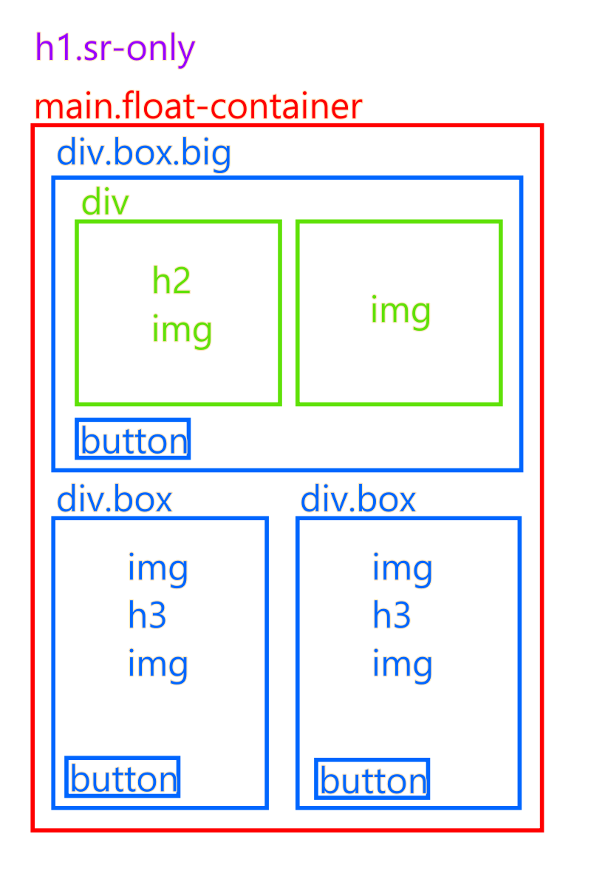

# HTML/CSS 과제 - 01

- 작성자 : 김종연

## 1️⃣ 개요

### 🔹 목표

- 어떠한 방법으로 디자인 시안의 레이아웃을 설계할 수 있는지 탐구하고, 다양한 diplay 방법을 사용하여 제작해본다.

### 🔹 기술 스택

- HTML
- CSS

### 🔹 디렉토리 구조

```bash
📦 mission-01
┣ 📁 images
┣ 📜 mission-01.html
┣ 📜 mission-01.css
┣ 📜 normalize.css
┣ 📜 mission-01.fig
┗ 📜 readme.md
```

## 2️⃣ 구현 내용

### 1. HTML 마크업 단계

#### &lt;flex 레이아웃&gt;

- 레이아웃 구조

  - CSS에서 flex를 2번 중첩할 계획으로 박스 요소들을 마크업 하였다.

    

  <details>
    <summary>전체 HTML 코드</summary>

  ```html
  <main class="flex-container">
    <h1 class="sr-only">상품 목록</h1>
    <div class="top-container">
      <div class="main-product-title">
        
        <h2>따뜻한 차 향기</h2>
      </div>
      
      <button class="buy-button" aria-label="구매하기"></button>
    </div>
    <div class="bottom-container">
      <div>
        <div class="sub-product-title">
          
          <h3>핸드크림 모음</h3>
        </div>
        
        <button class="buy-button" aria-label="구매하기"></button>
      </div>
      <div>
        <div class="sub-product-title">
          
          <h3>고소한 보리차</h3>
        </div>
        
        <button class="buy-button" aria-label="구매하기"></button>
      </div>
    </div>
  </main>
  ```

  </details>

#### &lt;float 레이아웃&gt;

- 레이아웃 구조

  - CSS에서 flex를 2번 중첩할 계획으로 박스 요소들을 마크업 하였다.

    

  <details>
    <summary>전체 HTML 코드</summary>

  ```html
  <main class="float-container">
    <h1 class="sr-only">상품 목록</h1>
    <div class="box big">
      <div class="main-item">
        
        <h2 class="main-text">따뜻한 차 향기</h2>
      </div>
      
      <button class="buying-button" aria-label="구매하기">
        
        <span class="focus-text">
          <span>구매하기</span>
        </span>
      </button>
    </div>
    <div class="box">
      
      <h2 class="sub-text">핸드크림 모음</h2>
      
      <button class="buying-button">
        
        <span class="focus-text">
          <span>구매하기</span>
        </span>
      </button>
    </div>
    <div class="box">
      
      <h2 class="sub-text">고소한 보리차</h2>
      
      <button class="buying-button">
        
        <span class="focus-text">
          <span>구매하기</span>
        </span>
      </button>
    </div>
  </main>
  ```

  </details>

---

### 2. CSS 스타일 단계

#### 전역 변수 설정

```css
:root {
  --border-color: #c4c4c4;
  --active-color: #0074e9;
  --primary-width: 502px;
  --secondary-width: 243px;
  --primary-text-color: #4e4e4e;
  --secondary-text-color: #555;
}
```

#### 기본 스타일 설정

```css
body {
  font-family: "Noto Sans KR", sans-serif;
  height: 100vh;
}

div {
  box-sizing: border-box;
}

h1,
h2,
h3 {
  margin: 0;
}

.sr-only {
  position: absolute;
  width: 1px;
  height: 1px;
  padding: 0;
  margin: -1px;
  overflow: hidden;
  clip: rect(0, 0, 0, 0);
  white-space: nowrap;
  border-width: 0;
}
```

---

#### &lt;flex 레이아웃&gt;

- flex 컨테이너
  ```css
  .flex-container {
    width: 502px;
    display: flex;
    flex-flow: column nowrap;
    gap: 16px;
    margin: 0 auto;
    padding: 50px 0;
  }
  ```
- top / bottom 컨테이너

  ```css
  .top-container {
    position: relative;
    width: var(--primary-width);
    height: 310px;
    border: 1px solid var(--border-color);
    padding: 20px 28px;
    display: flex;
    flex-flow: row nowrap;
    align-items: center;
    text-align: center;
  }

  .bottom-container {
    display: flex;
    flex-flow: row nowrap;
    gap: 16px;
  }
  ```

- top 컨테이너 내부 div요소 너비 1:1

  ```css
  .top-container > * {
    flex: 1;
  }
  ```

- 컨테이너 hover, focus 효과

  ```css
  .top-container:hover,
  .top-container:focus {
    border: 1px solid var(--active-color);
  }
  .top-container:has(.buy-button:hover, .buy-button:focus) {
    border: 1px solid var(--active-color);
  }

  .bottom-container > div:hover,
  .bottom-container > div:focus {
    border: 1px solid var(--active-color);
  }
  .bottom-container > div:has(.buy-button:hover, .buy-button:focus) {
    border: 1px solid var(--active-color);
  }
  ```

- 상품 콘텐츠

  ```css
  .main-product-title {
    margin-bottom: 40px;
  }
  .main-product-title > h2 {
    color: var(--primary-text-color);
    font-size: 24px;
    font-weight: 700;
    line-height: 150%;
    margin-top: 13px;
  }

  .sub-product-title {
    margin-bottom: 7px;
  }
  .sub-product-title > h3 {
    color: var(--secondary-text-color);
    font-size: 18px;
    font-weight: 700;
    line-height: 150%;
    margin-top: 10px;
  }
  ```

- 구매하기 버튼
  ```css
  .buy-button {
    position: absolute;
    bottom: 20px;
    left: 20px;
    width: 42px;
    height: 42px;
    padding: 0;
    border: none;
    background: rgba(0, 0, 0, 0.2);
    font-size: 14px;
    font-style: normal;
    font-weight: 500;
    color: #fff;
    cursor: pointer;
    transition: width 0.2s;
  }
  .buy-button img {
    position: absolute;
    top: 50%;
    transform: translateY(-50%);
    right: 17px;
    margin: 0 auto;
  }
  .buy-button:hover,
  .buy-button:focus {
    width: 112px;
    background: var(--active-color);
  }
  .buy-button::before {
    content: "";
    opacity: 0;
    transition: all 0.1s 0.1s;
  }
  .buy-button:hover::before,
  .buy-button:focus::before {
    content: "구매하기";
    margin-right: 16px;
    opacity: 1;
  }
  ```

---

#### &lt;float 레이아웃&gt;

- float 컨테이너
  ```css
  .float-container {
    width: 502px;
    margin: 50px auto;
    display: flow-root;
  }
  ```
- box와 big box
  ```css
  .box {
    position: relative;
    width: 243px;
    height: 310px;
    border: 1px solid var(--border-color);
    padding: 14px 23px;
    float: left;
    text-align: center;
  }
  .big {
    width: 502px;
    height: 310px;
    padding: 20px 28px;
    margin-bottom: 16px;
  }
  .box:last-child {
    margin-left: 16px;
  }
  .box:hover {
    border: 1px solid var(--active-color);
  }
  ```
- 상품 콘텐츠

  ```css
  .main-item {
    width: 222px;
    margin-top: 55px;
    float: left;
    display: flow-root;
  }
  .main-text {
    font-size: 24px;
    color: var(--primary-text-color);
    font-style: normal;
    font-weight: 700;
    line-height: 150%;
    margin-top: 13px;
  }
  .main-image {
    float: left;
  }

  .sub-text {
    font-size: 18px;
    color: var(--secondary-text-color);
    font-style: normal;
    font-weight: 700;
    line-height: 150%;
    margin-top: 10px;
  }
  ```

- 구매하기 버튼
  ```css
  .buying-button {
    position: absolute;
    bottom: 20px;
    left: 20px;
    width: 42px;
    height: 42px;
    padding: 0;
    border: 0;
    background: rgba(0, 0, 0, 0.2);
    cursor: pointer;
  }
  .focus-text {
    font-size: 14px;
    font-style: normal;
    font-weight: 500;
    line-height: 120%;
    color: #fff;
    display: none;
  }
  .focus-text img {
    margin-left: 16px;
  }
  .buying-button:hover,
  .buying-button:focus {
    width: 112px;
    background: var(--active-color);
    padding: 12px 18px 13px 20px;
  }
  .buying-button:hover > img,
  .buying-button:focus > img {
    display: none;
  }
  .buying-button:hover .focus-text,
  .buying-button:focus .focus-text {
    display: inline-block;
    vertical-align: top;
  }
  .box:has(.buying-button:hover, .buying-button:focus) {
    border: 1px solid var(--active-color);
  }
  ```

## 3️⃣ 동작


