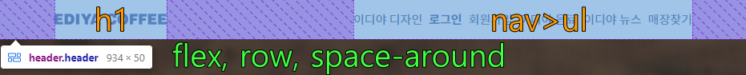
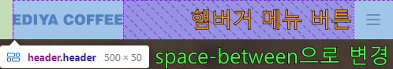
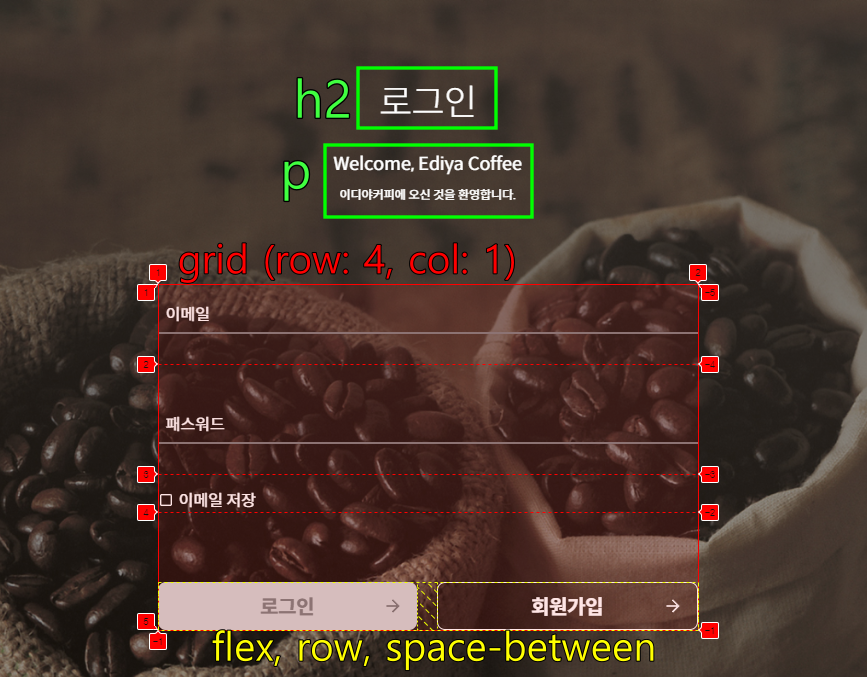
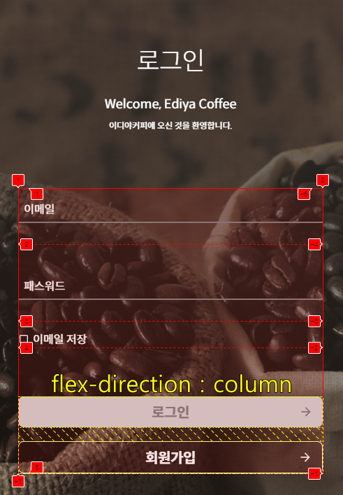

# HTML/CSS 과제 - 02

- 작성자 : 김종연

## 1️⃣ 개요

### 🔹 목표

- 이디야 커피의 로그인 페이지를 설계하고 로그인에 관한 유저 상호작용 효과들을 구현한다.

### 🔹 기술 스택

- HTML
- CSS
- Javascript

### 🔹 디렉토리 구조

```
📦mission-02
 ┣ 📂css
 ┃ ┣ 📜mission-02.css
 ┃ ┣ 📜reset.css
 ┃ ┗ 📜theme.css
 ┣ 📂images
 ┃ ┗ 📜생략
 ┣ 📂js
 ┃ ┗ 📜main.js
 ┣ 📜mission-02.html
 ┗ 📜README.md
```

## 2️⃣ 구현 내용

### 🔹 HTML 마크업과 CSS 디자인

- 로그인 페이지는 헤더영역과 메인(이하 로그인) 영역으로 나누어 마크업하였다.
- 반응형 디자인 breakpoint는 주어진 과제대로 `600px` 로 정하였다.
  - 데스크탑, 태블릿 : `600px` 이상
  - 모바일 : `600px` 이하 (`@media (max-width: 600px)`)
- CSS 디자인은 `데스크탑 퍼스트` 방식을 선택하였다.

#### 🔹 헤더 영역

- **데스크탑 디자인**

  

- 헤더 영역은 flex 레이아웃을 사용하였다.
- 반응형 디자인을 위해 `gap`을 고정적으로 주지 않고, `justify-content: space-around` 속성을 사용하여 부모요소의 `width` 에 따라 유동적으로 `gap`이 변하도록 설계하였다.
- 페이지의 메인 제목 `h1` 은 이디야 커피 로고 이미지가 들어가 있으며 대체 텍스트를 설정하여 이미지 미표시 및 스크린리더 사용에 대비하였다.
- 내비게이션바 `nav` 는 비순차 목록 `ul` 을 사용하였으며 각 리스트 아이템들을 `a`로 감싸서 하이퍼링크로 만들었다.

- **모바일 디자인**

  

  - 헤더 영역의 `justify-content` 속성을 `space-around` 에서 `space-between` 으로 변경하였다.
  - 그리고 데스크탑 디자인에 있던 내비게이션 비순차 목록 `ul`을 `display: none`으로 숨김처리하고 `display: none`이었던 햄버거 `button`을 `display: block`으로 변경하여 화면에 표시되도록 하였다.

#### 🔹 로그인 영역

- **데스크탑 디자인**

  

- 로그인 `form` 은 grid 레이아웃으로 만들어 보았다.
- `form` 의 `width` 는 `540px` 로 고정하였다. 값을 고정한 이유는 breakpoint가 `600px` 이기 때문에 레이아웃이 깨질 염려가 없다고 판단했기 때문에 고정 `width`로 결정하였다.
- 이메일, 패스워드, 이메일 저장, 로그인/회원가입버튼 총 4개의 `row`로 되어 있고 `column`은 1개 뿐이다.
- `grid-template-rows` 속성은 4개 모두 `auto` 로 지정하여 grid 아이템의 컨텐츠 크기만큼 `height`가 결정되도록 하였다.
- 각 grid 아이템간의 간격이 서로 달랐기에 `row-gap` 사용으로는 해결되지 않아서 각 아이템의 `margin-top` 값을 조정하여 간격을 조절하였다.
- 마지막 로그인과 회원가입 버튼은 여러가지 방법이 있지만 `div`로 감싸고 flex 레이아웃을 사용하여 두 버튼사이를 `space-between`으로 벌려놓았다.

- **모바일 디자인**

  

- 모바일 디자인에서 크게 달라지는 내용은 없고 `form` 의 grid 레이아웃 일부 속성을 변경하였다.
- 먼저 `width` 값은 레이아웃이 깨지지 않게 하기 위해서 `100%` 를 설정하여 부모 컨테이너 따라서 유동적으로 늘어났다 줄어들었다 하도록 만들었다.
- 마지막 로그인/회원가입 버튼은 `flex-direction` 을 `column` 으로 변경하여 위아래로 정렬되도록 하였다.

### 🔹 Javascript 인터랙션 디자인

- 과제 시연 동영상을 참고하여 Javascript를 사용하여 여러가지 기능들을 구현하였다.

#### 🔹 구현한 기능

- 입력창에 포커스 시, `label` 애니메이션 동작
- 입력창에 값 입력 시, 해당 값이 유효한지 검사하고 아이콘으로 알림
- 값이 유효하지 않을 경우 로그인 버튼 비활성화
- 패스워드 표시/가리기
- 이메일 저장 커스텀 체크박스 디자인

## 3️⃣ 동작


## 4️⃣ 회고

- 과제를 하면서 반응형 디자인이 여러 디바이스들을 맞춰야 하기 때문에 고려해야할 사항들이 다양하게 있다는 것을 느꼈다.
- 어떻게해서 마크업과 반응형 디자인은 다 완성하였지만 인터랙션 부분에서 자바스크립트를 많이(사실 전부 다) 사용하여 아쉬운 부분이 많았다.
- 자바스크립트 도움없이 HTML과 CSS 만을 사용하여 기능이 동작할 수 있도록 다시 코드를 고쳐볼 예정이다.
- 그리고 웹 접근성을 최대한 지켜보려고 했지만 역시나 뜻대로 되지가 않았다. 스크린 리더가 읽지 않는 부분들이 군데군데 존재했다. 이부분은 웹접근성 특강때 강의해주셨던 내용과 참고 사이트들을 읽어보면서 고쳐나가야겠다.
