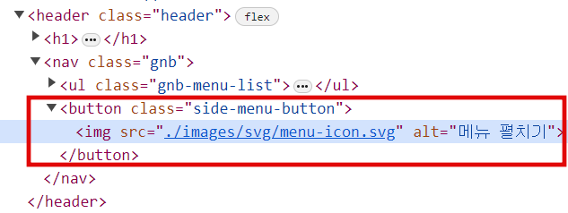
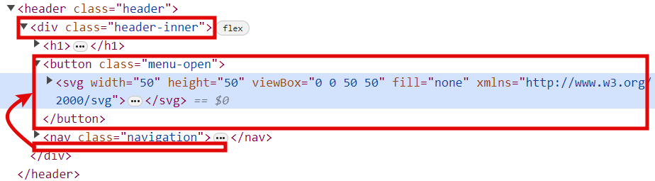
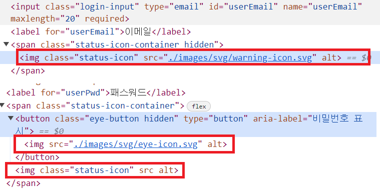
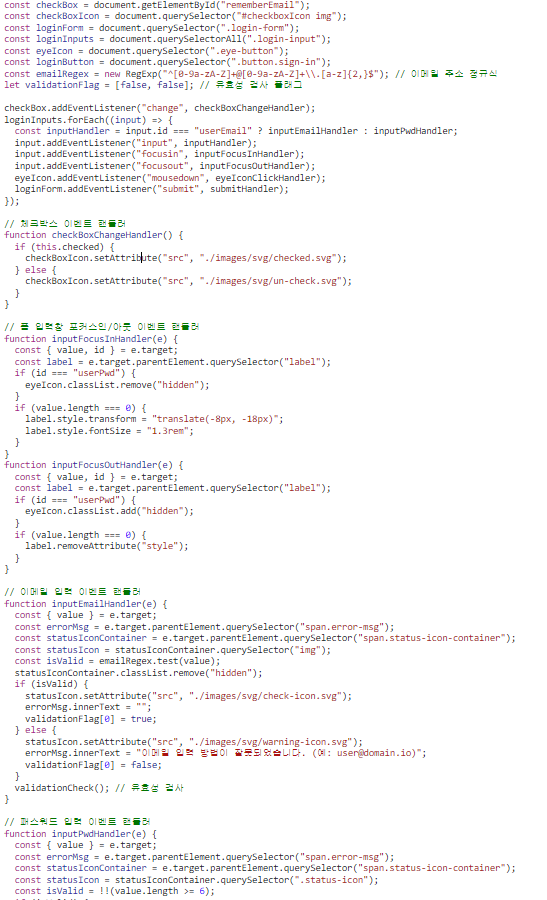

# 과제 피드백

## 피드백 내용 및 수정사항

### 1. 헤더 영역

- 메뉴 펼치기 버튼이 메인 메뉴보다 나중에 마크업

#### ◈ Before

  

#### ◈ After

1. 메뉴 펼치기 버튼요소를 navigation 위에 마크업하였습니다.
   
2. 오늘 수업때 배웠던 내용을 되새기면서 header에 `position: sticky` 적용하고, header 내부에에 header-inner 만들고 width를 `clamp()`로 반응형 스타일을 적용하였습니다.
   ```css
   /* 헤더 영역 */
   .header {
     position: sticky;
     top: 0;
     left: 0;
     z-index: 1;
     background: var(--grayscale-white);
   }
   .header-inner {
     width: clamp(600px, 90%, 1000px);
     height: 50px;
     display: flex;
     flex-flow: row nowrap;
     justify-content: space-between;
     align-items: center;
     flex-shrink: 0;
     gap: 10%;
     margin: 0 auto;
     color: var(--primary-blue-1);
     backdrop-filter: blur(2px);
   }
   ```

### 2. 로그인 영역

- 입력 값에 대한 상태를 나타내는 영역을 `` 요소로 마크업
- 자바스크립트까지 구현

#### ◈ Before





#### ◈ After

1. `` 요소로 이미지를 표시하던 것을 `<input>` 의 `background` 속성에 이미지를 표시하였습니다.
2. 최소한으로 자바스크립트 의존도를 줄이고, 최대한 HTML 마크업과 CSS 스타일을 활용하여 `<label>` 애니메이션, 입력값 유효성 검사, 커스텀 체크박스, 로그인 버튼 활성화 기능을 구현하였습니다.
3. 어떻게 하면 위의 기능을 HTML과 CSS로만 만들 수 있을까 고민하고 인터넷을 찾아본 결과 HTML `<input>`의 `pattern` 속성과 CSS `:placeholder-shown` 가상클래스를 알게 되었고, `<label>` 애니메이션과 입력값 유효성 검사를 구현할 때 매우 유용하게 사용하였습니다.
4. 비밀번호 표시 / 숨기기 기능은 도저히 CSS로 구현할 수 없다고 판단되어 자바스크립트를 사용하였습니다.
5. 추가적으로 오늘 배운 반응형 내비게이션 컴포넌트를 다시 만들어서 적용해보았습니다. 작동은 자바스크립트로 클래스를 추가하는 것으로 구현하였습니다.

- HTML 코드

```html
<div class="login-wrapper">
  <section class="login">
    <h2 class="login-title">로그인</h2>
    <p class="login-headline">Welcome, Ediya Coffee</p>
    <p class="login-sub-headline">이디야커피에 오신 것을 환영합니다.</p>

    <form class="login-form" action="./mission-02-edit.html" method="get">
      <div class="input-container">
        <input class="login-input" type="email" id="userEmail" name="userEmail" placeholder=" " maxlength="20" pattern="^[0-9a-zA-Z]+@[0-9a-zA-Z]+\.[a-z]{2,}$" required />
        <label for="userEmail">이메일</label>
        <span class="error-msg">이메일 입력 방법이 잘못되었습니다. (예: user@domain.io)</span>
      </div>

      <div class="input-container">
        <input class="login-input" type="password" id="userPwd" name="userPwd" placeholder=" " pattern="(?=.*?[a-zA-Z])(?=.*?[0-9]).{6,}" maxlength="20" required />
        <label for="userPwd">패스워드</label>
        <button type="button" class="toggle-password-view is-hidden" aria-label="비밀번호 표시하기"></button>
        <span class="error-msg">패스워드는 숫자, 영어 조합 6자 이상 입력해야 합니다.</span>
      </div>

      <div class="remember" aria-label="이메일 저장">
        <input class="rememberEmail sr-only" type="checkbox" name="rememberEmail" id="rememberEmail" />
        <label id="checkboxIcon" for="rememberEmail"><span aria-hidden="true">이메일 저장</span></label>
      </div>

      <div class="login-form-actions">
        <button class="button sign-in" type="submit">
          <span>로그인</span>
        </button>
        <a href="#" class="button sign-up">
          <span>회원가입</span>
        </a>
      </div>
    </form>
  </section>
</div>
```

- CSS 코드

```css
/* label 애니메이션 동작 */
.login-input:focus + label,
.login-input:not(:placeholder-shown) + label {
  transform: translate(-8px, -18px);
  font-size: 1.3rem;
}

/* 유효성 검사 아이콘 동작 */
/* 경고 아이콘 표시 */
.login-input:not(:placeholder-shown):invalid {
  background: url("../images/svg/warning-icon.svg");
  background-repeat: no-repeat;
  background-position: 98% 50%;
}
/* 체크(통과) 아이콘 표시 */
.login-input:not(:placeholder-shown):valid {
  background: url("../images/svg/check-icon.svg");
  background-repeat: no-repeat;
  background-position: 98% 50%;
}

/* 에러 메세지 */
/* 경고가 떴을 때 에러 메세지 표시 */
.login-input:not(:placeholder-shown):invalid ~ .error-msg {
  visibility: visible;
}
/* 유효성 검사 에러 메세지 */
.error-msg {
  display: block;
  height: 30px;
  font-size: 1.2rem;
  letter-spacing: -0.24px;
  padding: 5px 8px;
  visibility: hidden;
}

/* 이메일 저장 체크박스 */
.remember {
  width: 100px;
  margin-top: 1.4rem;
  display: flex;
  flex-flow: row nowrap;
}
.remember span {
  padding-left: 20px;
}
.rememberEmail:focus + label {
  border-radius: 5px;
  outline: 3px solid #1da1f2;
}
/* 체크박스 기본(체크안된) 상태*/
.rememberEmail + label {
  display: block;
  background: url("../images/svg/un-check.svg");
  background-repeat: no-repeat;
  user-select: none;
  background-position: 0% 50%;
}
/* 체크박스 체크 상태 */
.rememberEmail:checked + label {
  background: url("../images/svg/checked.svg");
  background-repeat: no-repeat;
  background-position: 0% 50%;
}

/* 로그인 버튼 활성화(기본 상태) */
.sign-in {
  background: url("../images/svg/arrow-right-active.svg") no-repeat 93% 50%, var(--grayscale-white);
  color: var(--primary-blue-1);
}

/* 로그인 버튼 비활성화 */
/* 이메일, 패스워드 둘다 invalid 또는 둘중 하나가 invalid 일 때 로그인 버튼 비활성화 */
.input-container:nth-child(1):has(.login-input:invalid) + .input-container:nth-child(2):has(.login-input:invalid) ~ .login-form-actions > .sign-in,
.input-container:nth-child(1):has(.login-input:valid) + .input-container:nth-child(2):has(.login-input:invalid) ~ .login-form-actions > .sign-in,
.input-container:nth-child(1):has(.login-input:invalid) + .input-container:nth-child(2):has(.login-input:valid) ~ .login-form-actions > .sign-in {
  color: #808080;
  background: #d2d2d2;
  pointer-events: none;
}
```
