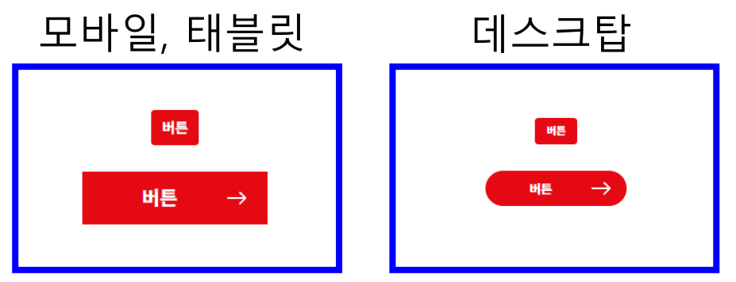
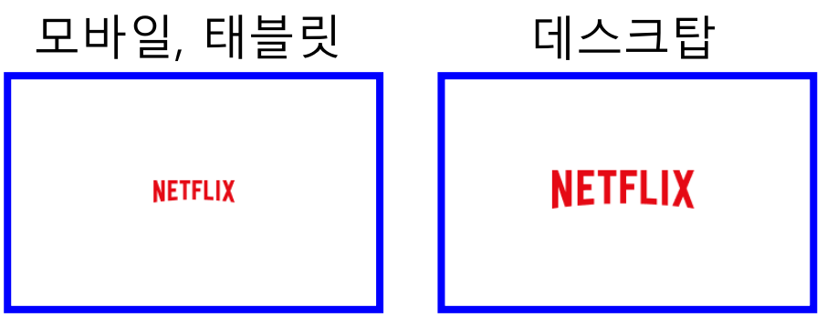
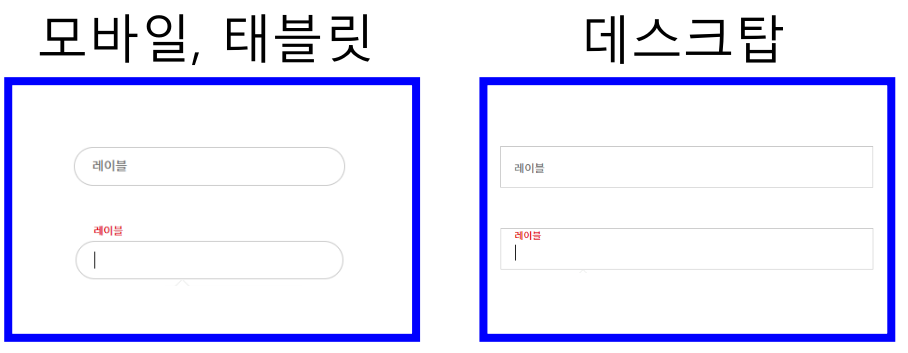
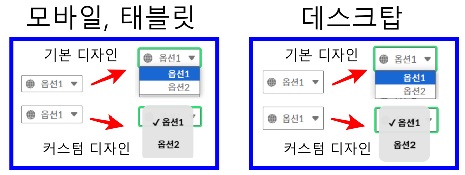
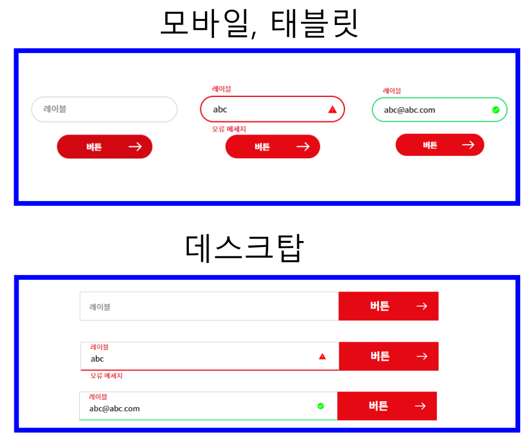
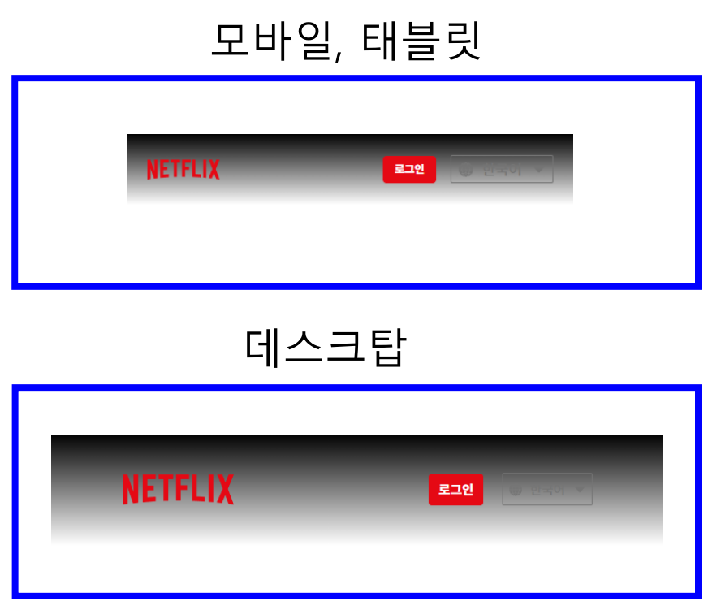
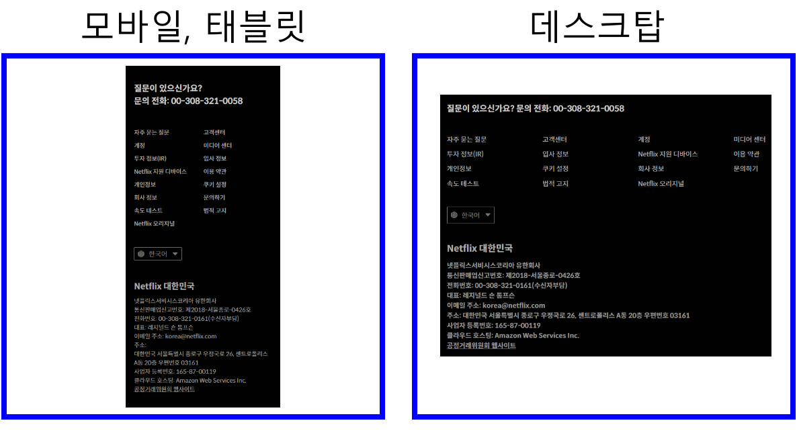
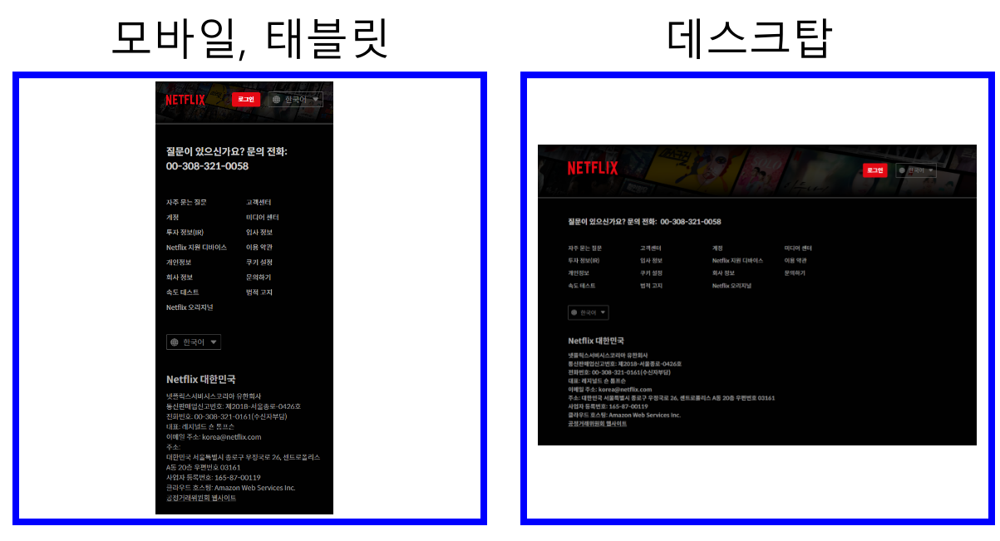
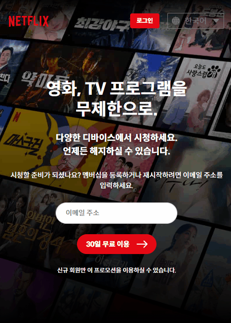

# HTML/CSS 과제 - 03

- 작성자 : 김종연

## 1️⃣ 개요

### 🔹 목표

- 컴포넌트 주도 개발(CDD) 방법론을 사용하여 넷플릭스 home 페이지 구현
  - _야무쌤께서 작성하신 [컴포넌트 주도개발 방법론](https://yamoo9.github.io/react-master/lecture/sb-cdd.html) 페이지를 참고하여 개발을 진행하였습니다._

### 🔹 기술 스택

- HTML
- CSS
- Javascript

### 🔹 디렉토리 구조

```
mission-03
 ┣ components (하위 파일 생략)
 ┃ ┣ buttons
 ┃ ┣ footer
 ┃ ┣ form
 ┃ ┣ header
 ┃ ┣ inputs
 ┃ ┣ logo
 ┃ ┣ selectbox
 ┃ ┣ template
 ┃ ┣ index.html
 ┃ ┗ index.css
 ┣ css
 ┃ ┣ base.css
 ┃ ┣ component.css
 ┃ ┣ mission-03.css
 ┃ ┣ reset.css
 ┃ ┣ styles.css
 ┃ ┗ theme.css
 ┣ images (하위 파일 생략)
 ┃ ┣ favicon
 ┃ ┣ logo
 ┃ ┣ svg
 ┣ mission-03.html
 ┣ mission-03.js
 ┗ README.md
```

## 2️⃣ 구현 내용

### 🔹 0단계 : 초기 구성

- CDD 방법론을 사용하기 위해 필요한 `component`, `css`, `images` 디렉토리들을 만들었습니다.
- CSS 스타일을 위해 필요한 css 파일들을 만들었습니다.
  1. `reset.css` : Agent 스타일 리셋
  2. `base.css` : 기본 스타일 정의
  3. `theme.css` : 피그마 디자인에서 추출한 global variable 정의
  4. `component.css` : 각 컴포넌트의 css파일들을 import
  5. `style.css` : 웹 폰트와 위의 1 ~ 4번 파일들을 import
  6. `mission-03.css` : 과제 페이지 컴포넌트 스타일 정의
- 컴포넌트 개발에 사용할 초기 템플릿을 구성하였습니다.

### 🔹 1단계 : 독립적인 컴포넌트 제작

- 먼저 각자 독립적으로 작동하는 컴포넌트들을 만들었습니다.
- 설명

  1. buttons : 버튼 컴포넌트

     

  2. logo : 로고 컴포넌트

     

  3. inputs : 입력창 컴포넌트

     

  4. selectbox : 셀렉트박스(드롭다운 메뉴) 컴포넌트

     

### 🔹 2단계 : 컴포넌트 결합

- 독립적인 컴포넌트를 결합하여 복잡성을 증가시키고 새로운 기능을 추가하였습니다.
- 설명

  1. form : 입력 폼 컴포넌트, [입력 + 버튼] 컴포넌트 결합, 유효성 검사 기능 추가

     

  2. header : 헤더 컴포넌트, [로고 + 셀렉트박스 + 버튼] 컴포넌트 결합

     

  3. footer : 푸터 컴포넌트, 내비게이션 요소 + [셀렉트박스] 컴포넌트 결합

     

### 🔹 3단계 : 페이지 조립 (템플릿)

- 2단계에서 만든 컴포넌트들을 결합하여 기본 템플릿 페이지를 조립하였습니다.
- 설명

  1. template : [헤더 + 푸터] 컴포넌트 결합, 백그라운드 이미지 추가

     

### 🔹 4단계 : 페이지 조립 (최종 home 페이지)

- 3단계에서 만든 템플릿 페이지에 `<main>` 영역을 추가하여 최종 구현 목표인 home 페이지를 조립하였습니다.
- `<main>` 영역

     

### 🔹 5단계 : 프로젝트에 페이지 통합

- 최종적으로 페이지 동작에 필요한 자바스크립트 로직을 추가하고 프로젝트 페이지를 완성하였습니다.

### 🔹 구현한 기능들

1. `<picture>, <source>, ` 요소를 사용하여 Device Pixel Ratio에 따라 로고 이미지 선택적 출력
2. 커스텀 셀렉트 박스 구현 (자바스크립트)
3. 폼 애니메이션 및 유효성 검사 (자바스크립트)

## 3️⃣ 동작

### [데모 페이지 바로가기](https://jykim29.github.io/home-work/)

- 데스크탑, 태블릿


- 모바일



## 4️⃣ 회고

-
